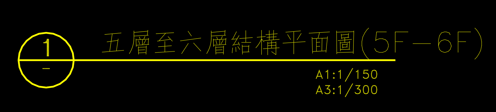
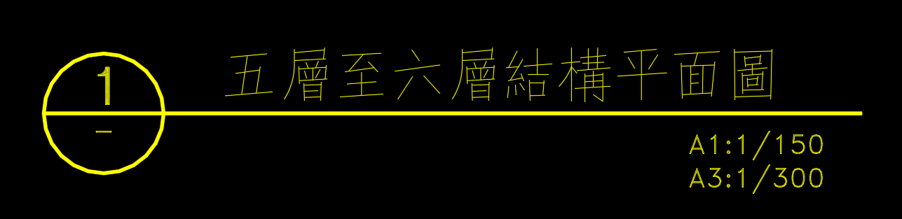
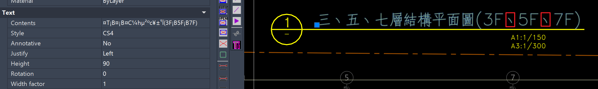
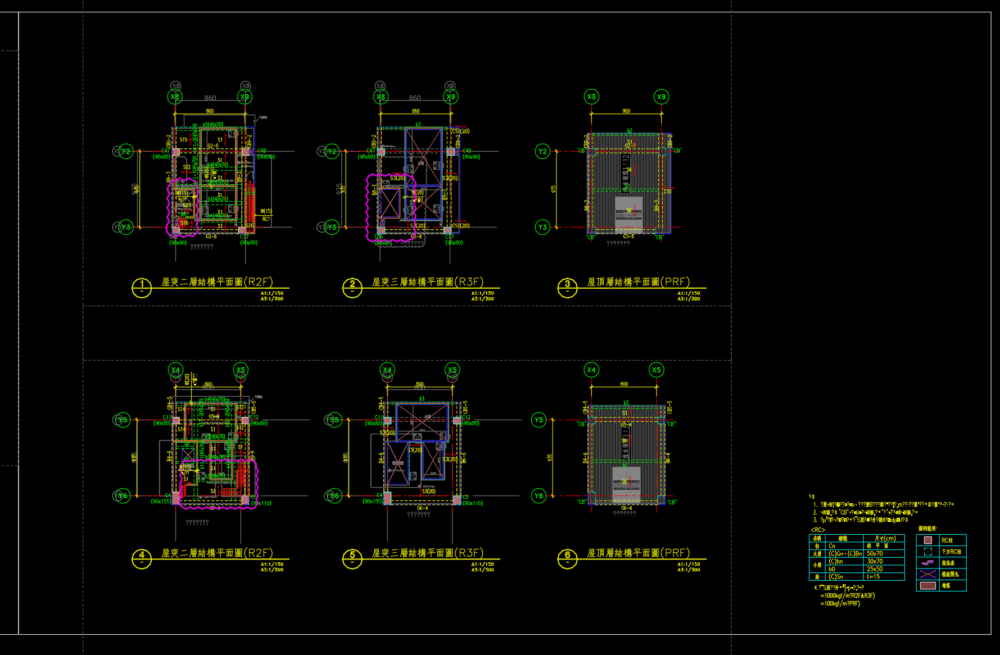
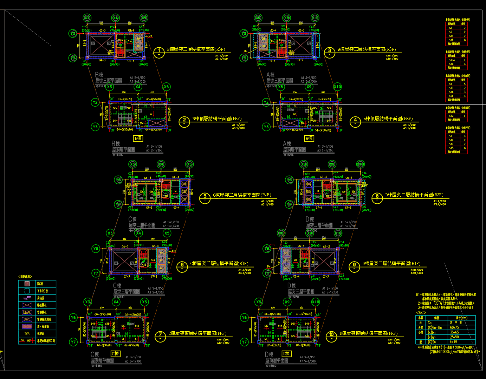

注意事項:
1. 請在title後面加上括號(ex. 地下五層結構平面圖(B5F), 五層至六層結構平面圖(5F-6F))

This is good.(有括號)

This is not good. (沒有括號)

2. 圖框的圖層要一致

3. 顯示樓層的字串中，'2-5F', '3F~6F', '3F,5F,7F' 等等都是可接受的，但盡量避免中文字元(可能會變成西班牙文亂碼)

This is not good. (頓號變成'¡B'了)

4. 在一個圖框中，盡量只放一張圖，如果要放兩張以上的圖，請將黃色標題放在圖的下方，比較不容易出錯。

This is good.(黃色標題都在圖的下方)

This is not good. (黃色標題都在圖的右方，梁跟樓層容易對錯)

5. 如果有很多東西被綁在同一個圖塊的話，請在explode填1，否則會讀不到東西。(只會在執行程式時把圖塊炸開，執行完程式後**不會**存檔，所以不用擔心圖被改掉。)
